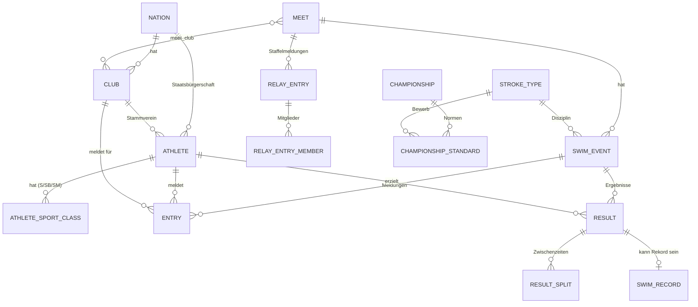

# Datenmodell

Dieses Dokument beschreibt die Kern-Entities und ihre Beziehungen, abgeleitet aus den Migrationen unter
`database/migrations`. Fachbegriffe (Sportklassen, Kurse, Statuswerte, Rekordtypen …) sind
im [Glossar](domain-glossary.md) erklärt.

## Allgemeine Konventionen

- Primärschlüssel sind `bigint` (`$table->id()`), Fremdschlüssel `foreignId`.
- `Nation`, `Club`, `Athlete`, `Meet`, `Classifier` nutzen **Soft Deletes**.
- **Zeiten** werden durchgehend als Integer in **Hundertstelsekunden**
  gespeichert (`entry_time`, `swim_time`, `split_time`, `value_centiseconds`). Konvertierung und Anzeige über
  `App\Support\TimeParser`
  (LENEX `HH:MM:SS.ss` ↔ Hundertstel).
- **Sportklassen** werden als String gehalten (z. B. `"S9"`, `"SB4"`, `"SM14"`). Bei `swim_events` stehen die
  zugelassenen Klassen als leerzeichenseparierter String in `sport_classes` (z. B. `"1 2 9 10"`).
- **Kurs** (`course` / `entry_course` / `meet_course`) ist eine Enum aus
  `LCM` / `SCM` / `SCY`.

## Kern-Beziehungen (Wettkampf)

## Stammdaten

**Nation** — `code` (IOC, z. B. AUT), `name_de`, `name_en`, `is_active`. Referenziert von Club, Athlete, Meet,
Classifier, SwimRecord.

**Club** — `name`, `short_name`, `code` (LENEX CLUB.code), `nation_id`,
`type` (`CLUB`/`VERBAND`), `regional_association` (BBSV, KBSV, NOEVSV, OOEBSV, SBSV, STBSV, TBSV, VBSV, WBSV), `swrid`.
Soft-deletes. → gehört zu **Nation**; hat viele **Athlete**, **Entry**, **Result**.

**Athlete** — `nation_id` (Staatsbürgerschaft), `club_id` (Stammverein, nullable),
`first_name`, `last_name`, `birth_date`, `gender` (M/F/N), `license`,
`license_ipc` (WPS/SDMS), `swrid`, `disability_type`, `level`, plus Kontakt-/ Adressfelder. Soft-deletes. → gehört zu
**Nation** und **Club**; hat viele **AthleteSportClass**, **AthleteClubHistory**, **AthleteLevelHistory**,
**AthleteKaderMembership**, **Entry**, **Result**.

**AthleteSportClass** — `athlete_id`, `category` (S/SB/SM), `class_number`,
`sport_class` (z. B. `"S9"`), `classification_scope` (INTL/NAT),
`classification_status`. Unique je `(athlete_id, category)` — also je genau eine S-, SB- und SM-Klasse pro Athlet.

**AthleteClubHistory** — Vereinszugehörigkeit über Zeit: `joined_at`, `left_at`
(null = aktuell), `is_active`.

**AthleteLevelHistory** — Einstufungen (`level`, `previous_level`, `changed_at`,
`user_id` als Bearbeiter).

**Classifier** / **AthleteClassification** — Klassifizierer (`type` MED/TECH) und Klassifizierungstermine eines Athleten
(`med_classifier_id`, `tech1/tech2`,
`result_s/sb/sm`, `classified_at`).

**ExceptionCode** / **athlete_exceptions** / **athlete_classification_exceptions**
— Ausnahmecodes (z. B. Hörbehinderung) und deren Zuordnung zu Athleten bzw. Klassifizierungen.

## Wettkampf

**Meet** — `name`, `city`, `nation_id`, `course`, `start_date`, `end_date`,
`entries_deadline`, `timing`, `entry_type` (OPEN/INVITATION), `is_open`,
`lenex_meet_id`, sowie später ergänzt `cup_id`, `qualifying_time_list_id` und
`wps_approved` / `wps_approved_note`. Soft-deletes. → hat viele **SwimEvent**;
n:m zu **Club** über `meet_club`; optional einem **Cup** und einer **QualifyingTimeList** zugeordnet.

`wps_approved` (boolean, Default **false**) kennzeichnet von World Para Swimming sanktionierte Wettkämpfe — nur deren
Zeiten gelten als Qualifikationsnachweis für internationale Meisterschaften. Der Default gilt ausdrücklich auch für den
Altbestand: `true` behauptete über jeden bestehenden Wettkampf eine Anerkennung, die niemand geprüft hat.
`wps_approved_note` hält die Fundstelle.

**SwimEvent** — `meet_id`, `stroke_type_id`, `event_number`, `session_number`,
`gender` (M/F/A/X), `round`, `distance`, `relay_count` (1 = Einzel, >1 = Staffel),
`sport_classes` (leerzeichensepariert), `lenex_event_id`. → gehört zu **Meet** und **StrokeType**; hat viele **Entry**,
**Result**.

**StrokeType** — `code`, `lenex_code` (FREE/BACK/BREAST/FLY/MEDLEY/IMRELAY),
`name_de`, `name_en`, `category` (standard/fin/special), `is_relay_stroke`.

**Entry** (Einzelmeldung) — `meet_id`, `swim_event_id`, `athlete_id`,
`club_id` (meldender Verein), `entry_time`, `entry_time_code`, `entry_course`,
`status`, `sport_class`, `heat`, `lane`. Unique je
`(meet_id, swim_event_id, athlete_id)`.

**Result** — wie Entry plus `swim_time`, `status`, `points`, `place`,
`reaction_time`, Rekord-Flags (`is_world_record`, `is_national_record`,
`is_junior_record`, `is_regional_record`, `is_regional_junior_record`),
`lenex_result_id`. Unique je `(meet_id, swim_event_id, athlete_id, heat, lane)`. → hat viele **ResultSplit**; kann von
einem **SwimRecord** referenziert werden.

**ResultSplit** — `result_id`, `distance`, `split_time`.

**RelayEntry** (Staffelmeldung) — `meet_id`, `swim_event_id`, `club_id`,
`relay_class`, `entry_time`, `entry_time_code`, `entry_course`, `status`. → hat viele **RelayEntryMember**
(`athlete_id`, `sport_class`), unique je
`(relay_entry_id, athlete_id)`.

## Rekorde

**SwimRecord** — `stroke_type_id`, `nation_id`, `athlete_id` (null bei Staffeln),
`result_id` (Herkunft), `superseded_by_id` / `supersedes_id` (Rekord-Historie),
`club_id`, `record_type`, `sport_class`, `gender`, `course`, `distance`,
`relay_count`, `swim_time`, `record_status`, `is_current`, `set_date`,
`meet_name`, `meet_city`, `meet_course`. → hat viele **RecordSplit** und (bei Staffeln) **RelayTeamMember**; verkettet
sich über `supersedes_id`/`superseded_by_id` zur Historie.

**RelayTeamMember** — `swim_record_id`, `position`, `first_name`, `last_name`,
`birth_date`, `gender`, optional `athlete_id`.

## World-Aquatics-Basiszeiten

**BaseTimeVersion** — `label`, `valid_from`, `valid_until` (Versionierung). **BaseTimeCategory** — `code`, `course`,
`gender`, `label`,
`ratio_reference_category_id` (Selbstreferenz für Ableitungen). **BaseTimeDiscipline** — `stroke_type_id` + `distance` +
`relay_count` + `code`
(Disziplin/Bewerb, unique). **BaseTimeSportClass** — `code`. **BaseTime** — Verknüpfung
`(version, category, discipline, sport_class)` mit Wert; `value_type` (MANUAL/…), unique über die vier FKs.
**BaseTimeDerivationRule** — leitet längere aus kürzeren Disziplinen ab (`shorter_discipline_id`,
`longer_discipline_id`, `ratio_reference_category_id`).

## WPS-Punkte

**PointSystem** — `name`, `code` (unique: `WA`, `WPS`, `OBSV1000`), `active`. Registry der
Punktesysteme; über den Pivot **meet_point_system** (`meet_id`, `point_system_id`,
`wps_point_version_id`) je Wettkampf zugeordnet. Die Versionsangabe am Pivot übersteuert die
automatische Zuordnung nach Wettkampfdatum.

**WpsPointVersion** — `label`, `year`, `version`, `source`, `official`, `status`
(`active`/`archived`), `valid_from`, `valid_until`. Unique über `(year, version)`.
`scopeValidOn()` löst nach Wettkampfdatum auf — die obere Grenze von `valid_from` wird mit
Uhrzeit verglichen, da date-Spalten je nach Treiber mit `00:00:00` abgelegt werden.

**WpsPointParameter** — Gompertz-Parameter `parameter_a/b/c` (decimal 14,6) je
`(version, course, gender, stroke_type_id, distance, relay_count, sport_class)`, unique über
diese Kombination. `official` unterscheidet veröffentlichte von abgeleiteten Sätzen. Bewusst
**keine** Fremdschlüssel auf `base_time_*` — jene Dimensionstabellen gehören zum
World-Aquatics-Modul und führen Sportklassen ohne S/SB/SM-Differenzierung.

**WpsScmConversionFactor** — Umrechnung Kurzbahn → Langbahn: `stroke_type_id`, `distance`
(nullable), `sport_class` (nullable), `gender` (nullable), `factor` (decimal 8,5), `source`
(`own_data`/`literature`/`manual`), `sample_size`, `confidence_level`, `approved_by`,
`approved_at`, `active`. `null` bedeutet jeweils "gilt für alle"; aufgelöst wird über eine
Kaskade vom Spezifischen zum Allgemeinen.

**Erweiterung `results`** — `wps_points`, `wps_point_version_id`, `wps_point_parameter_id`,
`wps_calculation_type` (`official`/`estimated`), `wps_calculated_at`,
`wps_estimated_lcm_time` (Hundertstel, nur bei Umrechnung), `wps_conversion_factor_id`.
`results.points` bleibt davon unberührt und trägt weiterhin die World-Aquatics-Punkte.

## Cup-Wertung

**Cup** — `name`, `base_time_version_id`, `is_active`. Ein Meet gehört über
`meets.cup_id` optional zu einem Cup. **AgeGroup** — `code`, `name_de`, `is_active` (Altersklassen).
**SportClassGroup** — `code` (PI, VI, II, T21, HI, TOP), `name_de`,
`is_virtual` (true = Top-Gruppe ohne feste Klassenmitglieder), `is_active`. **SportClassGroupMember** — ordnet einzelne
`sport_class` einer Gruppe zu (unique je `sport_class`). **KaderType** — `code`, `name_de` (z. B. Nationalkader); über
**AthleteKaderMembership** (`valid_from`/`valid_until`) mit Athleten verknüpft. **CupGroupSetting** /
**CupAgeGroupSetting** — je Cup aktivierte Sportklassen- gruppen bzw. Altersklassen (Aktivierung steuert die
Wertungsstruktur). **CupDailyResult** — pro `(cup, meet, athlete)` ein Tageswertungs-Eintrag (`club_id`, `result_id`,
`sport_class_group_id`, `gender`). **CupOverallResult** — Gesamtwertung je `(cup, athlete, gender, sport_class_group)`
mit `age_group_id` und `counted_daily_result_ids` (JSON). **CupTopGroupClassification** — Top-Gruppen-Snapshot je
`(cup, athlete)`:
`is_top_group`, `reason` (KADER / POINTS_HISTORY).

> **Hinweis:** Die Spalte in `cup_overall_results` heißt in der Erst-Migration
> `counted_daily_result_ids`, wurde per Migration
> `2026_07_17_090001_rename_counted_daily_result_ids_to_counted_meet_ids`
> in **`counted_meet_ids`** umbenannt (IDs würden bei Neuberechnung sonst
> veralten). Der finale Spaltenname ist `counted_meet_ids`.

## Internationale Qualifikation (EM/WM/Paralympics)

Nicht zu verwechseln mit den **Richtzeiten** weiter unten: Jene sind ÖBSV-Vorgaben für nationale Meisterschaften, diese
hier die Normen von World Para Swimming für internationale Meisterschaften. Anderer Herausgeber, anderer Zweck, andere
Lebensdauer — deshalb eigene Tabellen statt einer Erweiterung von `qualifying_time_lists`.

**Championship** — internationale Meisterschaft mit Qualifikationszeitraum: `name`, `short_name`, `type`
(`EC`/`WC`/`PARALYMPICS`/`OTHER`), `year`, `course` (Default `LCM`), `qualification_start`, `qualification_end`,
`source` (Herkunft der Normdatei), `notes`, `is_active`. Index über `(year, type)`. Jede Ausgabe ist ein eigener
Datensatz; Meisterschaften und ihre Normen werden nicht überschrieben, damit vergangene Entscheidungen nachvollziehbar
bleiben.

**ChampionshipStandard** — die einzelne Norm je Bewerb, Geschlecht und Sportklasse:
`championship_id` (cascade), `stroke_type_id` (restrict), `distance`, `gender` (enum M/F), `sport_class`,
`mqs_centiseconds`, `met_centiseconds`, `obsv_percent`, `obsv_centiseconds`, `obsv_is_manual`, `notes`. Unique über
`(championship_id, stroke_type_id, distance, gender, sport_class)`.

Bewusst **kein** FK auf `swim_events`: Ein SwimEvent wird je Meet neu angelegt, Normen gelten dagegen meetübergreifend
für einen Bewerbstyp. Struktur analog `qualifying_times` (`stroke_type_id` + `distance`).

Zwei Normebenen werden **beide** gespeichert — MQS/MET von World Para Swimming und die ggf. schärfere ÖBSV-Norm. Würde
nur die schärfere abgelegt, ließe sich später nicht mehr nachvollziehen, an welcher Hürde jemand gescheitert ist.

Bei `obsv_percent` ist `null` **nicht** dasselbe wie `0`: `null` heißt "noch nicht festgelegt" (offene Zeile), `0` heißt
"bewusst die MQS übernommen". Deshalb nullable **ohne** Default — ein Default tilgte die Unterscheidung, und eine
unbearbeitete Liste sähe aus wie eine fertige.

`obsv_is_manual` trennt eine aus dem Prozentsatz errechnete Zeit von einer von Hand gesetzten. Eine Massenaktion und
eine geänderte MQS rechnen nur die errechneten nach.

**Keine Ergebnistabelle.** Die Erfüllungsübersicht wird bei jedem Aufruf aus `results`, `meets` und
`championship_standards` berechnet und **nicht** persistiert. Reproduzierbar ist sie, weil alle Grundlagen historisiert
sind. Kaderzuordnung über `athlete_kader_memberships` zum Stichtag: heutiger Tag bei laufendem Qualifikationszeitraum,
dessen Ende bei abgelaufenem.

## Richtzeiten (Qualifikation)

**QualifyingTimeList** — Richtzeitenliste, `is_active`, mit Qualifikationszeitraum (per Migration ergänzt).
**QualifyingTargetPoint** — Zielpunkte je `(list, sport_class)`. **QualifyingTime** — konkrete Richtzeit je `(list, stroke_type, gender,
sport_class, …)` mit `value_centiseconds`; `source` (per Migration ergänzt). **QualifyingExcludedDiscipline** — von der
Qualifikation ausgeschlossene Disziplinen (`base_time_discipline_id`). **Qualification** — erfüllte Qualifikation:
`meet_id` (nullable),
`qualifying_time_list_id`, `qualifying_time_id`, `athlete_id`, `result_id`,
`club_id`, `sport_class`, `swim_time_centiseconds`, `points`, `qualified_at`. Unique je
`(meet_id, athlete_id, qualifying_time_id)`.

## Benutzer & Auth

**User** — Standard-Laravel-User plus `is_admin` und `club_id` (Vereinsbindung). Über `club_id` wird gesteuert, für
welchen Verein ein Nicht-Admin Meldungen verwalten darf (siehe `EntryPolicy`). Zwei-Faktor-Spalten via Fortify.
